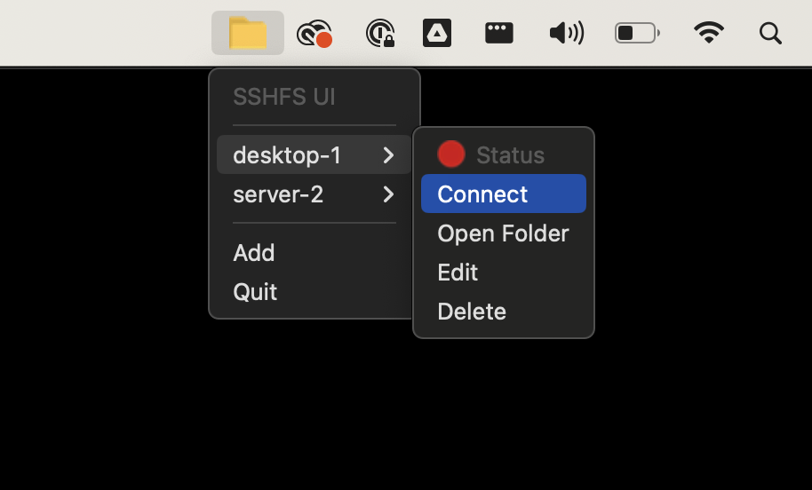
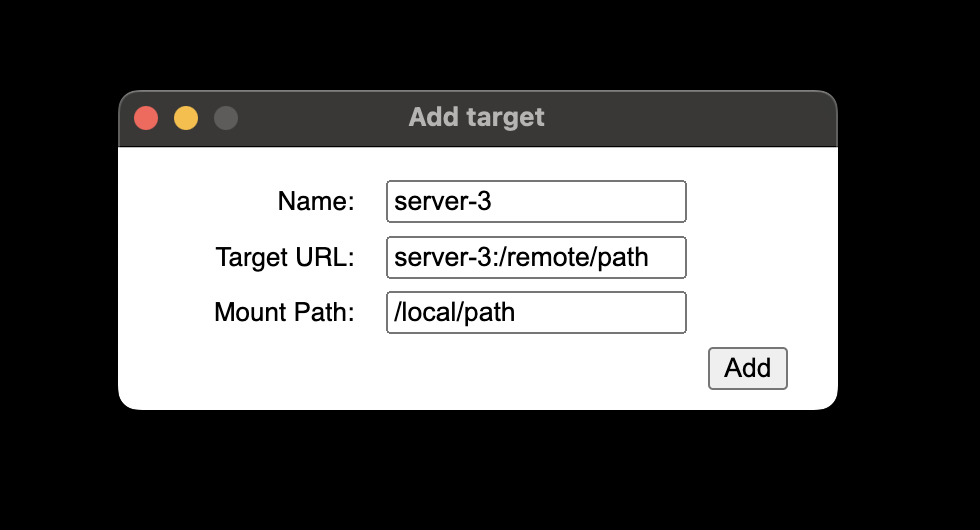
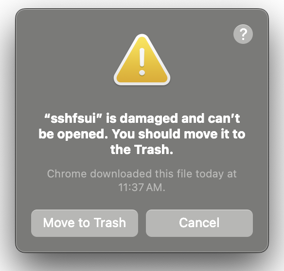

# sshfsui
UI to mount remote filesystems locally using SSHFS.

## Quickstart
`sshfsui` is a tray-based program. It can mount remote filesystems to local mount points which let's you interact with
these remote filesytems as if they were local. All changes to files are synchronized transparently in both directions.
This is done using SSH and SSHFS under the hood.



You can manage multiple targets. Each target has a name (needs to be file-safe) and related config:



## Installation
Download and run the installer for your OS and Architecture from [Github](https://github.com/thekashifmalik/sshfsui/releases/latest).

> **Note**: This software is not yet stable; there may be backwards-incompatible changes before v1. Use at your own
> risk.

### MacOS instructions
On MacOS you will need to run the following command before you can start the application:

```bash
xattr -c /Applications/sshfsui.app
```

This is needed since this application has not yet been signed via the Apple Developer Program.

If you attempt to start the application without running this command you will see the following error:


