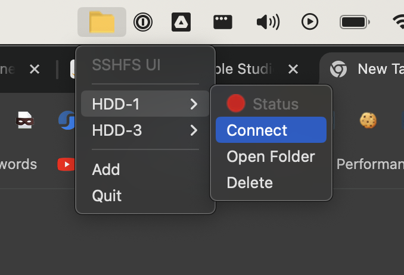

# sshfsui
Straightforward UI to manage your SSHFS mounts.

## Quickstart
`sshfsui` is a mostly tray-based program. It can create SSHFS mount targets, connect & disconnect to them and delete
these targets.

## Installation
Download the right installer for your OS and Architecture from [Github](https://github.com/thekashifmalik/sshfsui/releases).

> **Note**: This software is not yet stable; there may be backwards-incompatible changes before v1. Use at your own
> risk.
